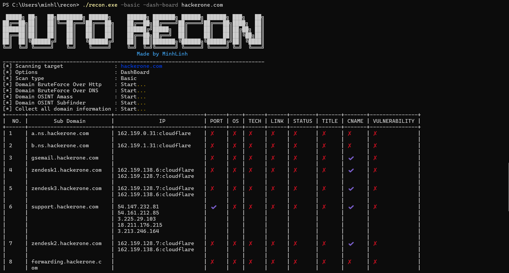
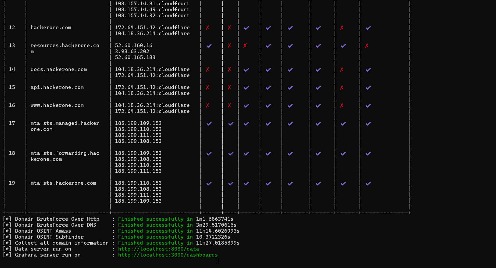
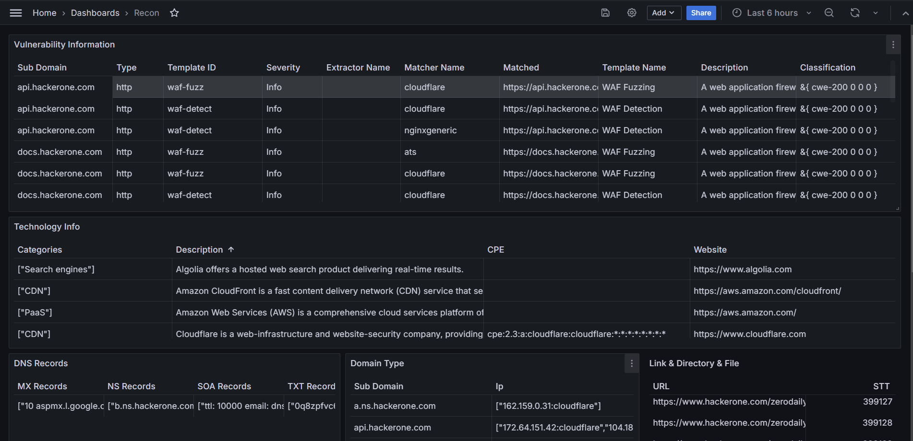
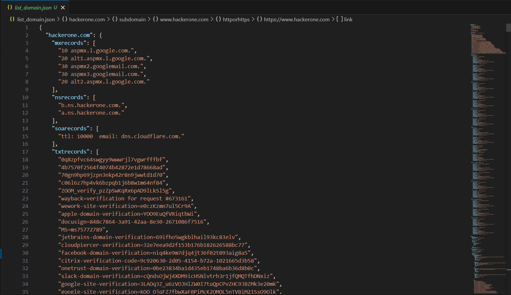

# He walked past, and she turned back and gave me one star ⭐

## 🎯 Overview

Scanning and information gathering tool for penetration testing. Information collected about
a domain such as: subdomain, ip, port and service, operating system, link, directory, files, and tech available on
the website.

All descriptions and reports are included in the documentation

---

## 🛠️ Requirements

- Golang
- Nmap installed on the machine
- Grafana

---

## ⚙️ Installation

To get started with Auto-recon, follow these simple steps:

```bash
$ git clone https://github.com/nguyenminhlinh/recon.git
$ cd recon
$ go mod tidy
```

---

## ✅ Function

This tool helps you collect data about:

1. **Domain OSINT Amass**: Collect subdomain using Amass.
2. **Domain BruteForce Over DNS**: Collect subdomain using brute force over dns and using wordlist https://github.com/danielmiessler/SecLists in directory data/input.
3. **Domain OSINT Subfinder**: Collect subdomain using Subfinder.
4. **Domain BruteForce Over Http**: Collect subdomain using brute force over http and using wordlist https://github.com/danielmiessler/SecLists in directory data/input. As you know, some subdomain don't have public on dns server. It have been accessed over edited header. This subdomain maybe is private or still testing process.
5. **Collect all domain information**: Collect IP, CNAME, PORT, SERVICE, OS, LINK, TECH, STATUS, TITLE, VULNERABILITY of Subdomain. It use Nmap, Naabu, Waybackurls, Wappalyzergo, Nuclei.

---

## 📖 Usage

### Run:

Run with cmd or powershell:

```bash
$ cd recon
$ go build .
$ ./recon.exe -<scantype> -<options> <domain>

OPTIONS:
 -dash-board:       Display dashboard over Grafana
 -report:           Create file report LateX
 -filename:         Write output to file name that you choose 

SCAN TYPE (Must have):
  -basic            Scan with basic type
  -moderate         Scan with moderate type
  -comprehensive    Scan with comprehensive type

```

Wait and check result in `list_domain.json`

---

### Install Grafana

1. Install Grafana Windows Open Source

- Download file from Grafana: https://dl.grafana.com/oss/release/grafana-11.2.2.windows-amd64.zip
- To install the standalone Windows binary, complete the following steps:

  a. Click Download the zip file.

  b. Right-click the downloaded file, select Properties, select the unblock checkbox, and click OK.

  c. Extract the ZIP file to any folder.

- Start Grafana by executing grafana-server.exe, located in the bin directory.

2. Setup Grafana

- Access http://localhost:3000/ to go to Grafana. Then login with username and password is admin.

- Direc to `Connections > Add new connection` and add `JSON API`.

- Click `Add new data source` on right corner. Paste link `http://localhost:8080/data` into `URL`. Change `Name` to what you want.

- And remember end character `ddzxx0xka2o00a` of `http://localhost:3000/connections/datasources/edit/ddzxx0xka2o00a` on url browser. `(1)`.

- Click `Save & test`.

3. Setup Dashboard

- Change "your_uid" in file `\pkg\data\input\config_dashboard_grafana.txt` by character in `(1)`.

- Select `Dashboards > New dashboard`. Click `Import dashboard`.

- Copy `config_dashboard_grafana.txt` to `Import via dashboard JSON model` and `Load`.

## 📝 Example



---



---



---



---