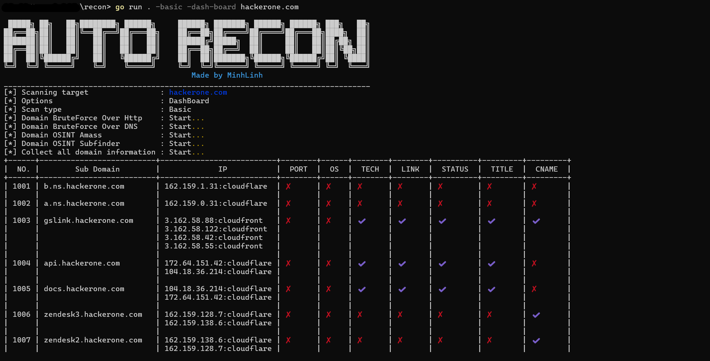

## 🎯 Overview

Scanning and information gathering tool for penetration testing. Information collected about
a domain such as: subdomain, ip, port and service, operating system, link, directory, files, and tech available on
the website.

All descriptions and reports are included in the documentation

---

## 🛠️ Requirements

- Golang
- Nmap installed on the machine

---

## ⚙️ Installation

To get started with Auto-recon, follow these simple steps:

```bash
$ git clone https://github.com/nguyenminhlinh/recon.git
$ cd recon
$ go mod tidy
```

---
## ✅ Function

This tool helps you collect data about:

1. **DomainOSINTAmass**: 
2. **DomainBruteForceDNS**: 
3. **DomainOSINTSubfinder**: 
4. **DomainBruteForceHttp**: 
5. **DirAndFileBruteForce**:

---

## 📖 Usage

### Run basic:

Run with cmd or powershell:

```bash
$ cd recon
$ go run . domain
```
Wait and check result in `list_domain.json`

---
### Run and display DashBoard Grafana:

Run with cmd or powershell:
```bash
$ cd recon
$ go run . -dash-board domain
```

1. Install Grafana Windows Open Source

- Download file from Grafana: https://dl.grafana.com/oss/release/grafana-11.2.2.windows-amd64.zip
- To install the standalone Windows binary, complete the following steps:

    a. Click Download the zip file.

    b. Right-click the downloaded file, select Properties, select the unblock checkbox, and click OK.

    c. Extract the ZIP file to any folder.
- Start Grafana by executing grafana-server.exe, located in the bin directory.
2. Setup Grafana

- Access http://localhost:3000/ to go to Grafana. Then login with username and password is admin.

- Direc to `Connections > Add new connection` and add `JSON API`.

- Click `Add new data source` on right corner.  Paste link `http://localhost:8080/data` into `URL`. Change `Name` to what you want.

- And remember end character `ddzxx0xka2o00a` of `http://localhost:3000/connections/datasources/edit/ddzxx0xka2o00a` on url browser. `(1)`.

- Click  `Save & test`.

3. Setup Dashboard

- Change "your_uid" in file `\pkg\data\input\config_dashboard_grafana.txt` by character in `(1)`.

- Select `Dashboards > New dashboard`. Click `Import dashboard`.

- Copy `config_dashboard_grafana.txt` to `Import via dashboard JSON model` and `Load`.


## 📝 Example



---


---
