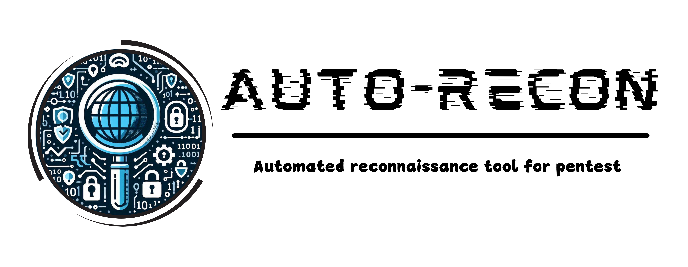

## 🎯 Overview

Scanning and information gathering tool for penetration testing. Information collected about
a domain such as: subdomain, ip, port and service, operating system, link, directory, files, and tech available on
the website.

All descriptions and reports are included in the documentation

---

## 🛠️ Requirements

- Golang
- Nmap installed on the machine

---

## ⚙️ Installation

To get started with Auto-recon, follow these simple steps:

```bash
$ git clone https://github.com/nguyenminhlinh/recon.git
$ cd recon
$ go mod tidy
```

---

## 📖 Usage

Run with cmd or powershell
```bash
$ cd recon
$ go run . domain
```
---

## 📝 Example


---


---
